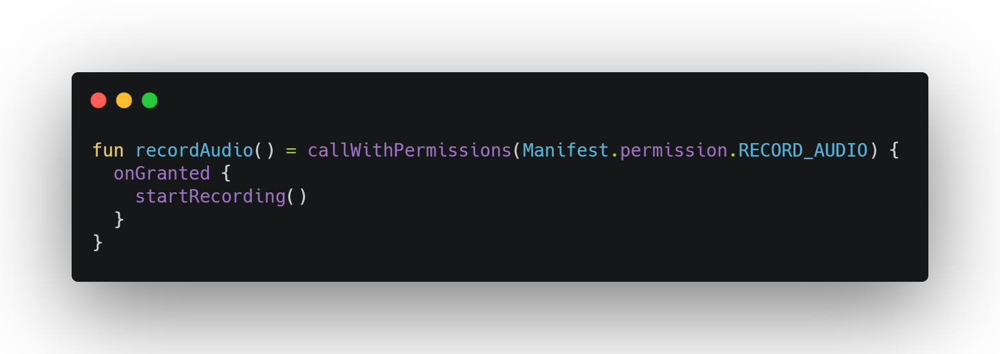

# AKPermission

[](https://jitpack.io/#li-yu/AKPermission)


A lightweight Android Runtime Permissions handler in Kotlin, also with coroutines.

## Usage

Step 1. Add it in your root build.gradle at the end of repositories:

```
allprojects {
    repositories {
        ...
        maven { url "https://jitpack.io" }
    }
}
```

Step 2. Add the dependency:

```
dependencies {
	implementation 'com.github.li-yu:AKPermission:1.2.2'
}
```

Step 3. Coding:

You can use `callWithPermissions(...)` in **Activity**, **Fragment**, **View** and **Context**(based on AppCompatActivity) just like below:

```kotlin
callWithPermissions(Manifest.permission.RECORD_AUDIO,
    Manifest.permission.WRITE_EXTERNAL_STORAGE) {
    onGranted {
        // all granted
    }
    onDenied {
        // denied, contains NeverAskAgain and ShowRationale permissions
    }
    onNeverAskAgain {
        // denied, and user checked NeverAskAgain button
    }
    onShowRationale {
        // denied, but not checked NeverAskAgain button
        // we need to explain to the user why these permissions are needed
        AlertDialog.Builder(this@MainActivity)
			.setMessage("Record Audio needs this permissions")
			.setTitle("Hi")
			.setPositiveButton("Yes") { _, _ ->
				it.retry()
			}
			.setNegativeButton("No", null)
			.create()
			.show()
    }
}
```

### Kotlin Coroutine

Use `callWithPermissionsResult(...)` in coroutines, for example:

```kotlin
suspend fun downloadFile() = withContext(Dispatchers.IO) {
    val result = callWithPermissionsResult(Manifest.permission.WRITE_EXTERNAL_STORAGE)
    if (result.isAllGranted) {
        startDownload()
    }
}
```

### Notes

AKPermission supports **androidx** only, and requires at minimum Android 6.0(Api 23).

### License

[Apache License Version 2.0](https://github.com/li-yu/AKPermission/blob/master/LICENSE)
